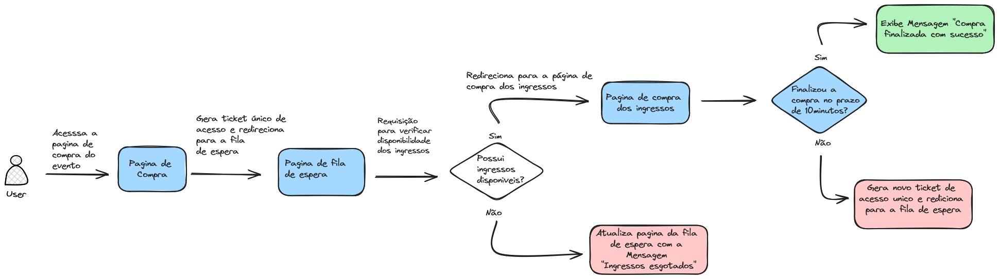

### Desenho da Arquitetura 

### Passo a Passo da Solução

1. **Distribuição de Tickets e Redirecionamento para Fila de Espera**
    - Quando o cliente acessar a página de compra de ingressos para o evento, ele receberá um ticket único de acesso gerado aleatoriamente.
    - Este ticket determinará a posição do cliente na fila de espera.
    - O cliente será redirecionado automaticamente para uma página de fila de espera.
2. **Monitoramento da Fila de Espera**
    - Na página de fila de espera, o sistema realizará requisições periódicas a cada 5 segundos para verificar a disponibilidade de ingressos e a posição do cliente na fila.
    - Essas requisições serão feitas de forma assíncrona para minimizar a carga no servidor e proporcionar uma experiência fluida ao usuário.
3. **Notificação de Ingressos Esgotados**
    - Se durante o processo de espera os ingressos se esgotarem, a página de fila de espera será atualizada imediatamente para informar ao usuário que os ingressos estão esgotados.
4. **Redirecionamento para a Página de Compra**
    - Se houver ingressos disponíveis e o usuário alcançar a posição necessária na fila, ele será redirecionado automaticamente para a página de compra de ingressos.
5. **Processo de Compra e Limite de Tempo**
    - Na página de compra de ingressos, o usuário terá um limite de 10 minutos para finalizar sua compra.
    - Durante este período, os ingressos serão temporariamente reservados para o usuário.
    - Caso a compra não seja concluída dentro do período de 10 minutos, o usuário será redirecionado de volta para o final da fila de espera.
    - A reserva dos ingressos será cancelada, permitindo que outros clientes tenham a oportunidade de adquiri-los.
